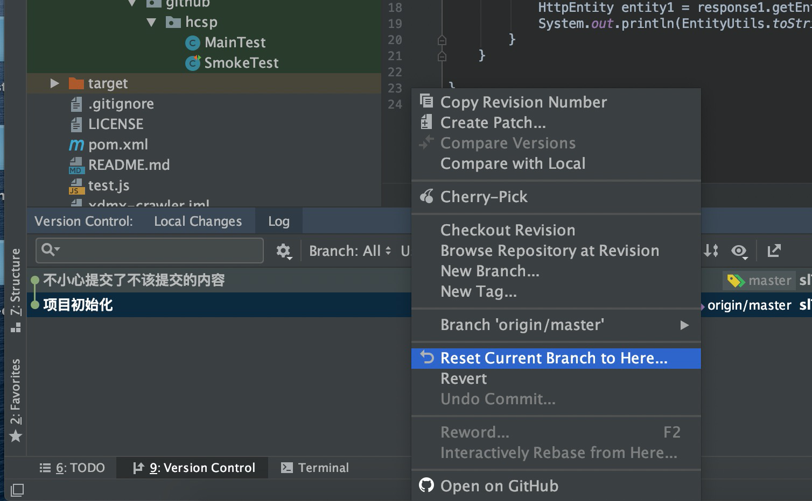
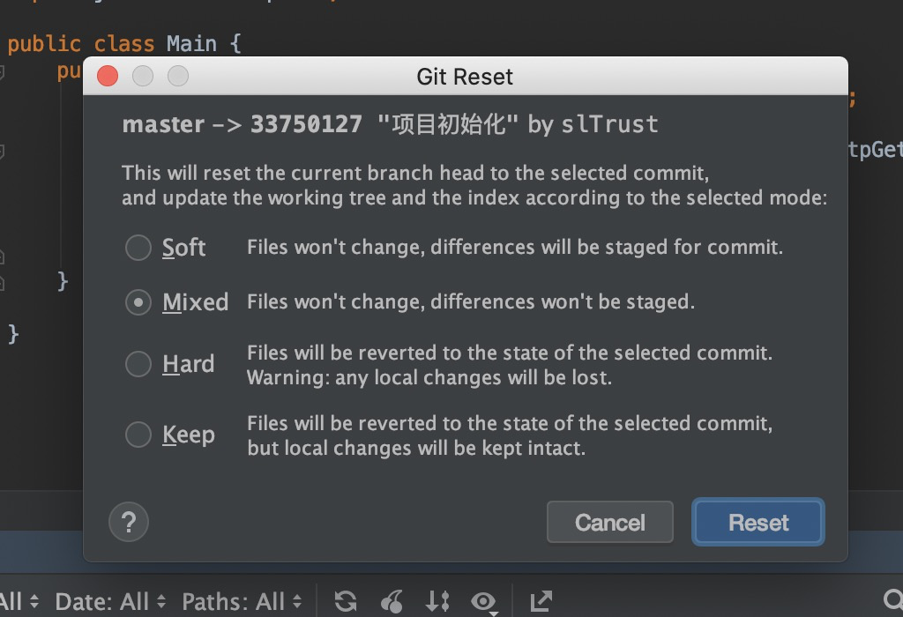
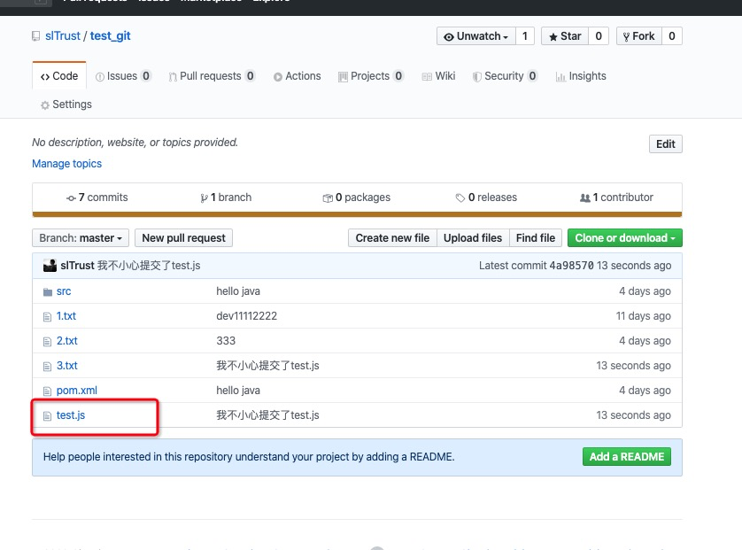

### git你不小心提交了不该提交的文件怎么办？

- 比如你直接 `git add .` 不小心把 `.idea目录提交了`
```
# 请你这样 `git status`
# 你会看到
Changes to be committed:
  (use "git restore --staged <file>..." to unstage)

# 意识是这些内容即将被提交
```
- `git restore --staged .idea` 把暂存区的 ".idea" 撤销
    - 你还可以这样 `git reset HEAD .idea`  

### git你不小心把内容 commit了怎么办？

- 你不仅 `git add .idea`了
- 还把 它 `git commit -m "不小心提交了不该提交的内容"`

> 你可以这样

```
# 把当前代码重新设置， 就是回到当前代码的头分支，把它向后回滚一个提交
git reset HEAD~1

# 回滚两次
git reset HEAD~2
# 回滚三次
git reset HEAD~3
```

> 你说你不会用 git 命令行～ 

- 没关系，在 idea里 下方的 Version Control
- 右键点击前一个commit 选择 Reset Current Branch to Here

- 之后会弹出一个框，不用管他 默认就好


### 如果不小心commit 而且还 push了怎么办?

```
test.js 我不想提交 
但是不小心提交了，而且还push了
```

如图



> 第一步 `git log`

- 找到你的提交编号

```
commit 4a9857060de055a729a239776aea10bd814985f9 (HEAD -> master, origin/master, origin/HEAD)
Author: slTrust <trustfor@sina.cn>
Date:   Fri Apr 24 10:52:28 2020 +0800

    我不小心提交了test.js

commit 8f55c3e8674d8e2269cec3457d77f3510d6ea656
Author: slTrust <trustfor@sina.cn>
Date:   Mon Apr 20 17:12:42 2020 +0800

    hello java
```

> 第二步 `git revert`

- 它会撤销刚才的提交
- **缺点是你这边提交的内容全部没了**

```
git revert 4a9857060de055a729a239776aea10bd814985f9
```


### 重回刚才的状态

```
git reset 4a9857060de055a729a239776aea10bd814985f9

git reset HEAD --hard
# 此时你还是 提交了 你不想提交的内容 test.js  同时还 push了
```

> 如果你是在主干的话，建议直接把它手工删掉,重新提交


> 如果你是在自己的分支

```
# 把当前代码重新设置， 就是回到当前代码的头分支，把它向后回滚一个提交
git reset HEAD~1


# 在 .gitignore 里 添加 test.js 忽略
git add .
git commit -m "我修改了刚刚的错误提交"

# 查看状态 你发现 git status
On branch master
Your branch and 'origin/master' have diverged,
and have 1 and 1 different commits each, respectively.
  (use "git pull" to merge the remote branch into yours)
# 意思是 你跟 origin/master 分叉了， 就是你回退的过程中，你跟主干的代码不一样 这时候直接 push 是不行的

git push
提示你
To https://github.com/slTrust/test_git.git
 ! [rejected]        master -> master (non-fast-forward)
error: failed to push some refs to 'https://github.com/slTrust/test_git.git'
hint: Updates were rejected because the tip of your current branch is behind
hint: its remote counterpart. Integrate the remote changes (e.g.
hint: 'git pull ...') before pushing again.
hint: See the 'Note about fast-forwards' in 'git push --help' for details.

# 此时你需要 
git push -f
```

### 如果不小心commit还push了的正确姿势

> 如果是在你的分支上

- 你就 `git reset HEAD~1` 你本地回退到上一个提交
- 把你不想提交的内容 做对应处理
- `git add .` => `git commit -m "xxx"`
- `git push -f`

> 如果是在主干上

- 老老实实把多提交的东西删掉。

#### 这个撤回提交的代码只能你自己看到吗？

- 只要你没 push 都只能你自己看到


