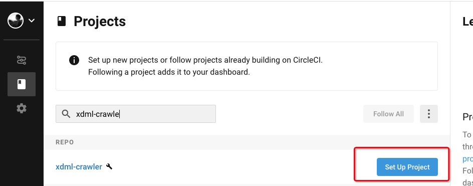

### CircleCI

它为开源项目提供免费的测试

- https://circleci.com/
- GitHub账号登录
- 找到 Go to App
- 到达你的面板
- 点击 add Project




- 只要你push代码 就帮你做CI 自动化测试

进去默认直接 start building

#### 这里遇到一个坑:restore_cache

- 意思就是这个key可能会重复
- 详情参考 https://circleci.com/docs/2.0/caching/

```
# 我之前有个项目用的也是 这个 ，结果一直报错
- restore_cache:
    key: hcsp-{{ checksum "pom.xml" }}
```

- 根据上面文档提示 加一个版本号 就好了，如下

```
version: 2
jobs:
  test:
    docker:
      - image: circleci/openjdk:8u212-jdk-stretch
    steps:
      - checkout
      - restore_cache:
          key: v1-hcsp-{{ checksum "pom.xml" }}
      - run:
          name: Run Maven tests
          command: mvn clean test
      - save_cache: # saves the project dependencies
          paths:
            - ~/.m2
          key: v1-hcsp-{{ checksum "pom.xml" }}
workflows:
  version: 2
  default:
    jobs:
      - test

```