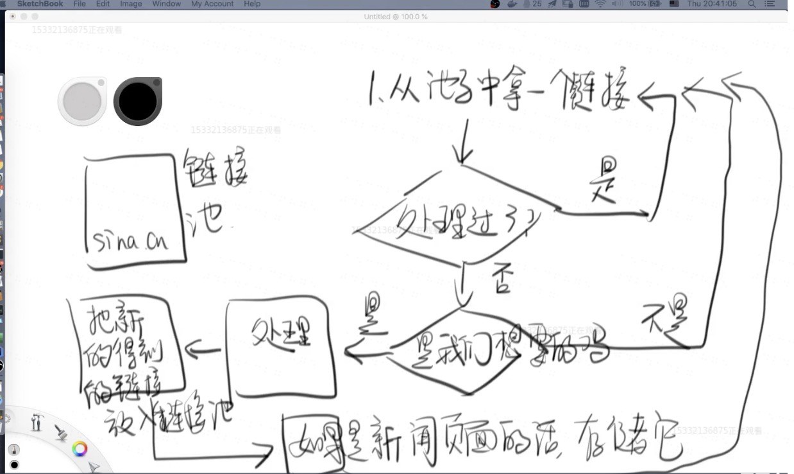

## 项目目标

- 爬取新浪新闻页
- 使用数据库存储并进行数据分析
- 随着数据量的增长，迁移到ES
- 做一个简单的“新闻搜索引擎”

### 确定算法 

- 为什么互联网被称为“网”，爬虫被称为“爬虫”
    - https://sina.cn/ 这个页面包含很多 a 标签，每个a 对应一个网页，同时它又有很多 a标签
    - 从一个节点出发，遍历所有的节点
- 算法：广度优先算法的一个变体
    - 非常建议自己手写相关算法
        - 广度优先/队列数据结构/JDK的队列实现



- 如何扩展？
    - 慢慢把烂代码、啰嗦的代码重构
    - 假设未来我要更换数据库/上ES
    - 爬虫的通用化

### 实现我们的逻辑

> 不要在master上开发，不要在master上开发，不要在master上开发

- 新开分支

```
git checkout -b basic-algorithm
```