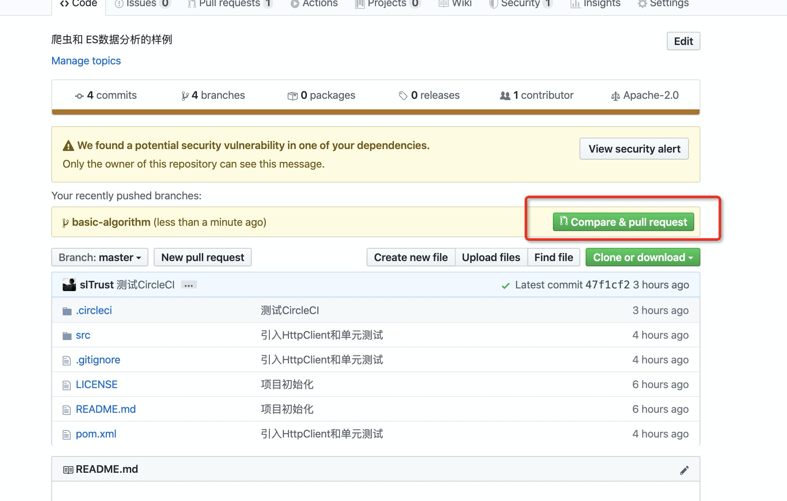
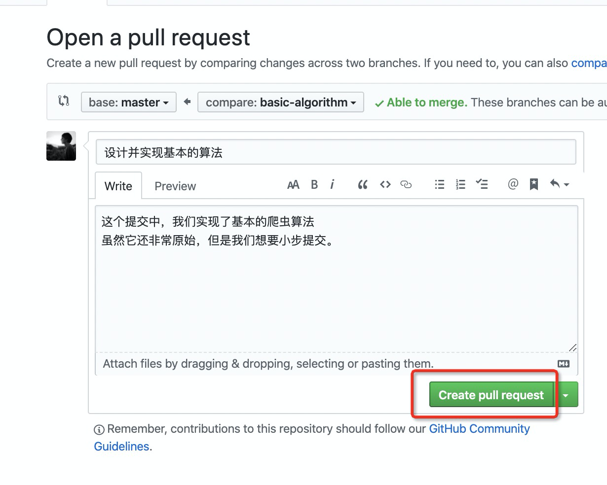
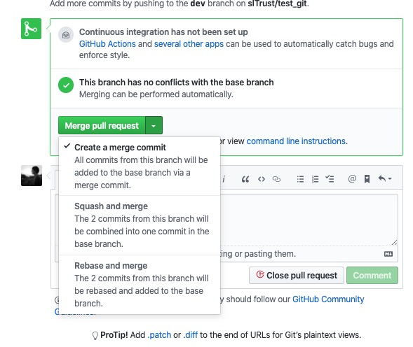

## 爬虫的初步实现

- 引入 jsoup 解析html
- 不会 jsoup怎么办 
    - google jsoup parse html
    - https://jsoup.org/cookbook/input/parse-document-from-string
- 惯用技巧：如果你不知道 API

```
断点行  IDEA右键 Evaluate Expression
输入你的变量 一直 点出来各种 api
```

代码如下

```
public class Main {
    public static void main(String[] args) throws IOException {

        // 待处理的链接池
        List<String> linkPool = new ArrayList<>();
        Set<String> processedLinks = new HashSet<>(); // 已经处理过的链接池

        linkPool.add("https://sina.cn/");
        while (true){
            if (linkPool.isEmpty()){
                break;
            }

            String link = linkPool.remove(linkPool.size() - 1); // ArrayList 从尾部删除更有效率, 而且 remove会把删除元素返回

            if (processedLinks.contains(link)) {
                continue;
            }

            if (link.contains("sina.cn") && !link.contains("passport.sina.cn") && (link.contains("news.sina.cn") || "https://sina.cn/".equals(link))) {
                // 这是我们感兴趣的，我们只处理站内的链接
                CloseableHttpClient httpclient = HttpClients.createDefault();

                if (link.startsWith("//")) {
                    link = "https:" + link;
                }

                HttpGet httpGet = new HttpGet(link);
                httpGet.addHeader("User-Agent", "Mozilla/5.0 (Macintosh; Intel Mac OS X 10_14_6) AppleWebKit/537.36 (KHTML, like Gecko) Chrome/76.0.3809.100 Safari/537.36");
                try (CloseableHttpResponse response1 = httpclient.execute(httpGet)) {
                    System.out.println(link);
                    if (response1.getStatusLine().getStatusCode() != 200){
                        continue;
                    }
                    HttpEntity entity1 = response1.getEntity();
                    String html = EntityUtils.toString(entity1);

                    Document doc = Jsoup.parse(html);

                    ArrayList<Element> links = doc.select("a");
                    for (Element aTag:links){
                        linkPool.add(aTag.attr("href"));
                    }

                    // 如果这是个新闻的页面就存入
                    ArrayList<Element> articleTags = doc.select("article");
                    if (!articleTags.isEmpty()) {
                        for (Element articleTag: articleTags){
                            String title = articleTags.get(0).child(0).text();
                            System.out.println(title);
                        }
                    }

                    processedLinks.add(link);
                }
            } else {
                // 这是我们不感兴趣的
            }
        }
    }
}
```

- 运行`mvn test` 把不合法的格式改正


## 重构

- 随着你的条件越来越多，if也越来越多

```
// 你觉得这样好吗？
if (link.contains("sina.cn") && !link.contains("passport.sina.cn") && (link.contains("news.sina.cn") || "https://sina.cn/".equals(link))) { ... }
```

> 你可能会在上面加个注释 

- **这是一个中策**
- 注释会过时，比如代码到了2年后，注释一直没动，但是代码不停的变更。一个写了注释没有正确反映代码的注释比不写还要糟糕

```
// 我们只关心 news.sina的 我们要排除登录页面
if (link.contains("sina.cn") && !link.contains("passport.sina.cn") && (link.contains("news.sina.cn") || "https://sina.cn/".equals(link))) { ... }
```

> 提取成一个方法

```
if (isInterestingLink(link)) { ... }
```

> IDEA提取代码块为一个方法

- 选中代码块
- 右键 Refactor  => Extract => Method

> 使用 java8 代替 for

```
ArrayList<Element> links = doc.select("a");
for (Element aTag:links){
    linkPool.add(aTag.attr("href"));
}

Document doc = httpGetAndParseHtml(link);
doc.select("a").stream().map(aTag -> aTag.attr("href")).forEach(linkPool::add);
```

#### 重构后的代码

```
public class Main {
    public static void main(String[] args) throws IOException {

        // 待处理的链接池
        List<String> linkPool = new ArrayList<>();
        // 已经处理的链接池
        Set<String> processedLinks = new HashSet<>();
        linkPool.add("https://sina.cn");

        while (true) {
            if (linkPool.isEmpty()) {
                break;
            }

            // ArrayList从尾部删除更有效率
            String link = linkPool.remove(linkPool.size() - 1);

            if (processedLinks.contains(link)) {
                continue;
            }

            // 我们只关心news。sina的，我们要排除登陆页面
            if (isInterestingLink(link)) {
                Document doc = httpGetAndParseHtml(link);
                doc.select("a").stream().map(aTag -> aTag.attr("href")).forEach(linkPool::add);
                // 假如这是一个新闻的详情页面，就存入数据库，否则，就什么都不做
                storeIntoDatabaseIfItIsNewsPage(doc);
                processedLinks.add(link);

            } else {
                // 这是我们不感兴趣的，不处理它
            }
        }

    }

    private static void storeIntoDatabaseIfItIsNewsPage(Document doc) {
        ArrayList<Element> articleTags = doc.select("article");
        if (!articleTags.isEmpty()) {
            for (Element articleTag : articleTags) {
                String title = articleTags.get(0).child(0).text();
                System.out.println(title);
            }
        }
    }

    private static Document httpGetAndParseHtml(String link) throws IOException {
        // 这是我们感兴趣的，我们只处理新浪站内的链接
        CloseableHttpClient httpclient = HttpClients.createDefault();

        if (link.startsWith("//")) {
            link = "https:" + link;
            System.out.println(link);
        }

        HttpGet httpGet = new HttpGet(link);
        httpGet.addHeader("User-Agent", "Mozilla/5.0 (Macintosh; Intel Mac OS X 10_14_6) AppleWebKit/537.36 (KHTML, like Gecko) Chrome/76.0.3809.100 Safari/537.36");

        try (CloseableHttpResponse response1 = httpclient.execute(httpGet)) {
            System.out.println(response1.getStatusLine());
            HttpEntity entity1 = response1.getEntity();
            String html = EntityUtils.toString(entity1);
            return Jsoup.parse(html);
        }
    }

    private static boolean isInterestingLink(String link) {
        return (isNewsPage(link) || isIndexPage(link)) && isNotLoginPage(link);
    }

    private static boolean isIndexPage(String link) {
        return "https://sina.cn".equals(link);
    }

    private static boolean isNewsPage(String link) {
        return link.contains("news.sina.cn");
    }

    private static boolean isNotLoginPage(String link) {
        return !link.contains("passport.sina.cn");
    }
}
```


### 提交代码

```
git add .
git commit -m "你的信息"
# 此时远程是没有这个分支的所以 没反应
git push

# 你可以这样
git push --set-upstream origin basic-algorithm
```

- 此时你的代码就push到新分支了







如果你的代码有问题，就会失败。**注意此时不用开启新的PR**

- 每当你在同一分支 push 你的变更会继续出现在这里，进行代码检查

通过之后显示这个



- create a merge commit 
    ```
    # 等价于
    git checkout master
    git merge basic-algorithm
    # 它会产生一个新的提交
    ```
- squash and merge
    ```
    # 好处是把多个提交压扁成一个提交，回滚的时候非常方便
    ```
- rebase and merge


### 神器：纠正你的错误命令

- https://github.com/nvbn/thefuck

