## SpotBugs 插件引入

- **不要做一个只会从网上抄代码的人**
- 如何阅读和使用官方文档？
- Maven生命周期
- Maven的插件和目标
    - 目标与生命周期阶段的绑定


> SpotBugs 使用

- [官网](https://spotbugs.github.io/)

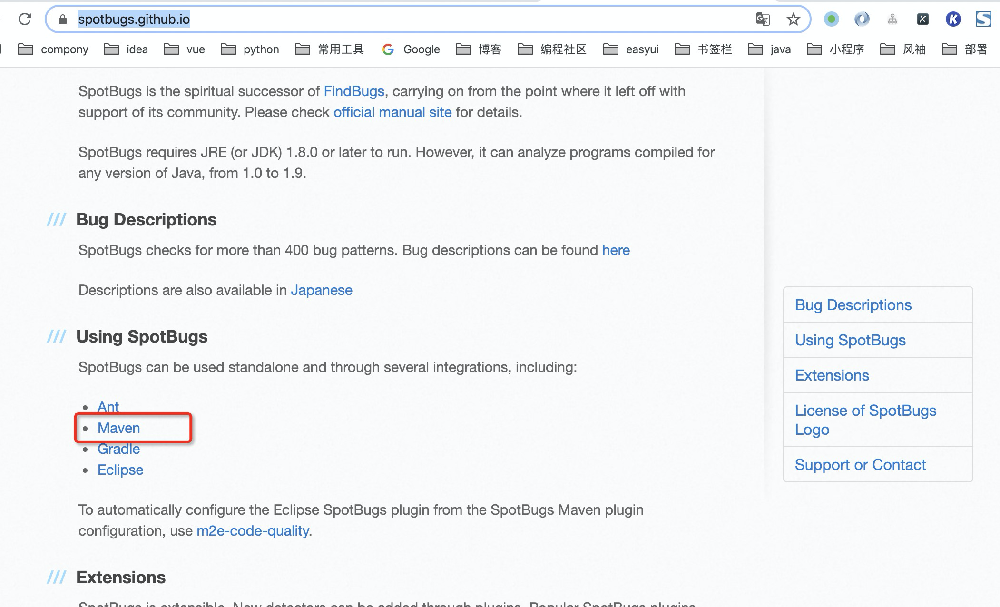

上来给你一段 pom.xml的内容 直接加入我们的项目即可

```
<plugin>
    <groupId>com.github.spotbugs</groupId>
    <artifactId>spotbugs-maven-plugin</artifactId>
    <version>3.1.12</version>
    <dependencies>
        <!-- overwrite dependency on spotbugs if you want to specify the version of spotbugs -->
        <dependency>
            <groupId>com.github.spotbugs</groupId>
            <artifactId>spotbugs</artifactId>
            <version>4.0.0-beta3</version>
        </dependency>
    </dependencies>
</plugin>
```

### 什么是 goal?

继续看文档，它有一堆goal ,但是我是 maven新手 看不懂怎么办？

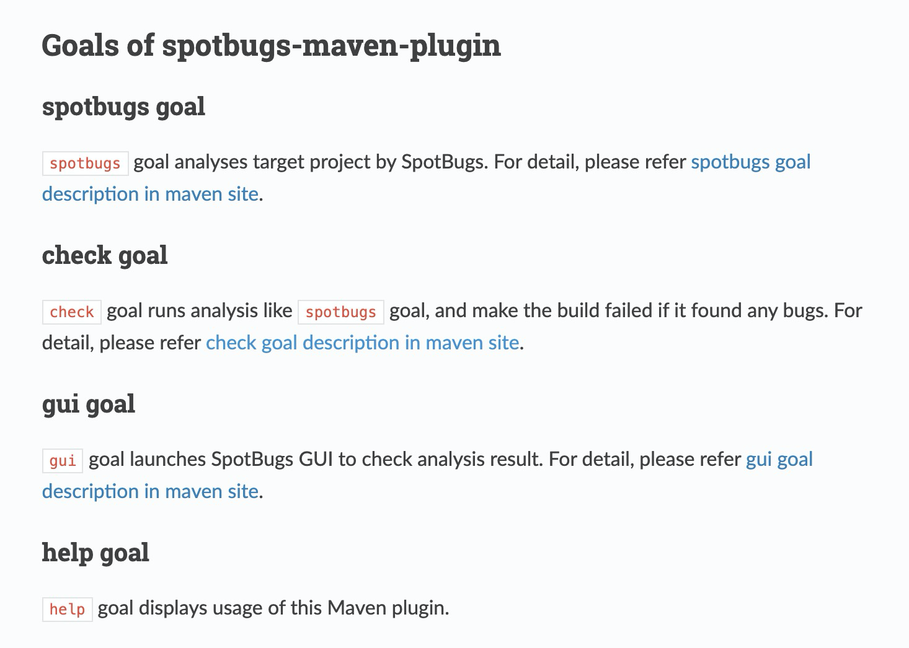

```
// Main.java里 输入如下内容 ,这是一个明显错误
public static void main(String[] args) throws IOException {

    Integer i = null;
    if( i == 1){
        System.out.println();
    }
    // ...
}

# maven 约定是 如果你是插件 则可以直接运行它
mvn spotbugs:check
# 这样会失败，原因是 你还没有编译它就直接 这样是不行的

```

> 修改pom.xml 将`mvn spotbugs:check`这句话绑定到 verify 阶段

```
<plugin>
    <groupId>com.github.spotbugs</groupId>
    <artifactId>spotbugs-maven-plugin</artifactId>
    <version>3.1.12</version>
    <dependencies>
        <!-- overwrite dependency on spotbugs if you want to specify the version of spotbugs -->
        <dependency>
            <groupId>com.github.spotbugs</groupId>
            <artifactId>spotbugs</artifactId>
            <version>4.0.0-beta3</version>
        </dependency>
    </dependencies>

    <executions>
        <execution>
            <id>spotbugs</id>
            <phase>verify</phase>
            <goals>
                <goal>check</goal>
            </goals>
        </execution>
    </executions>
</plugin>
```

- 然后运行`mvn verify`

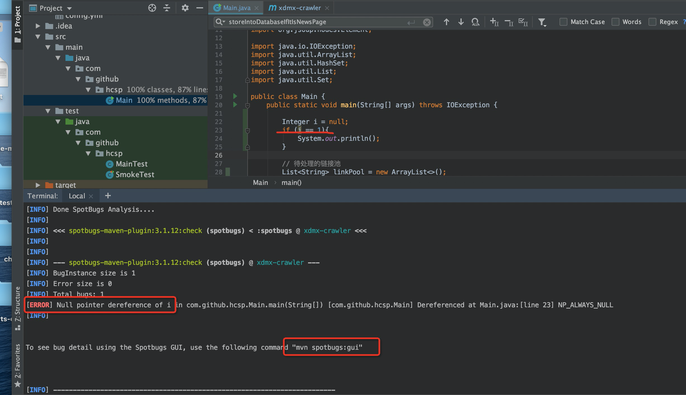

提示你代码有错误！

- To see bug detail using the Spotbugs GUI, use the following command "mvn spotbugs:gui"
- 于是你运行`mvn spotbugs:gui`
- 就会显示一个可视化界面

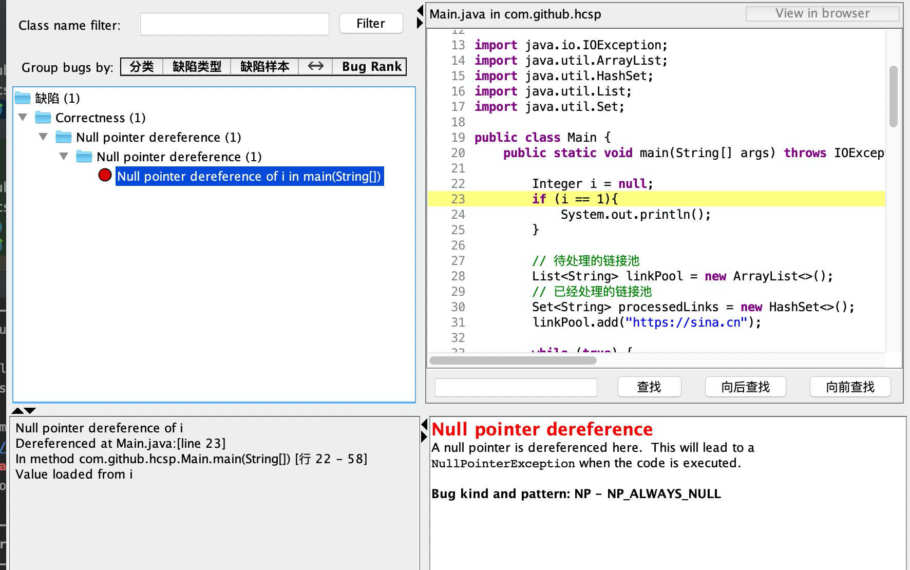


### Maven 生命周期

- [google maven lifecycle](https://maven.apache.org/guides/introduction/introduction-to-the-lifecycle.html)

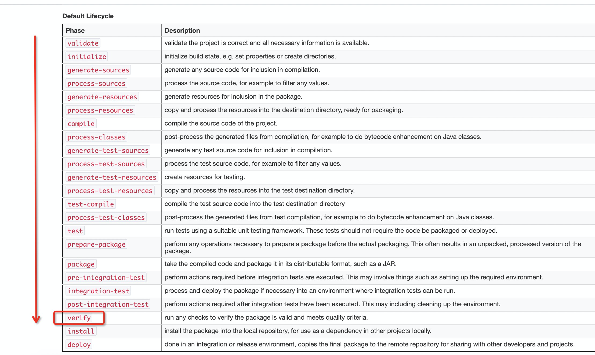

> 当你运行`mvn verify`之后

- 从头到 verify 把每个阶段执行一次


#### 那么，默认这些 生命周期阶段会做什么？

- **默认什么都不做，除非你告诉它们**

#### 怎么告诉 maven 某个阶段做什么呢？

- **通过maven插件**

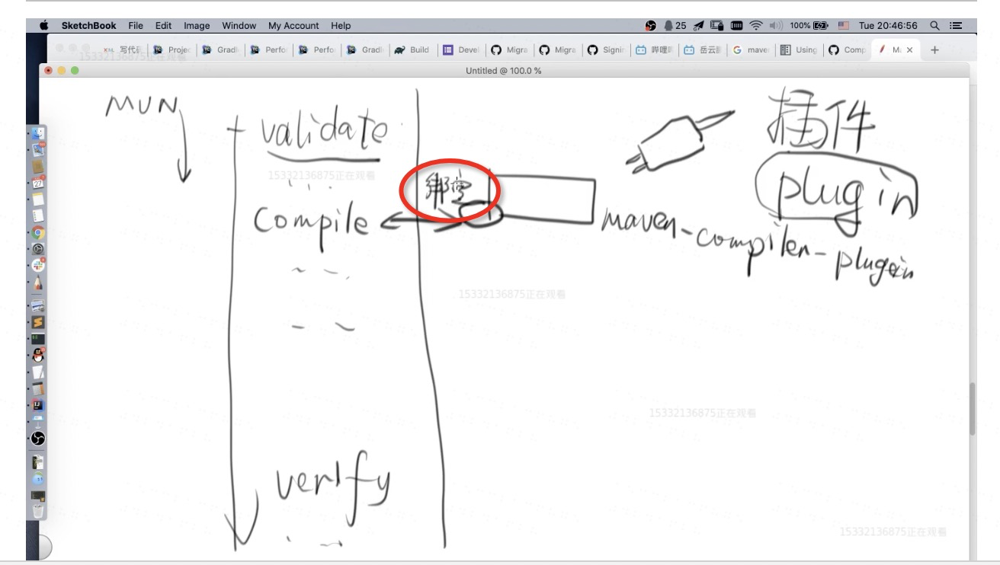

- maven有很多阶段 和很多plugin
- 这个 “maven-compiler”插件的“绑定” 在哪写的？
    - “maven-compiler” 有默认的阶段绑定，不需要你手动写

**因此当 maven 到达 compiler 阶段，就会执行这个工作**

这个工作叫做 **目标 goal**

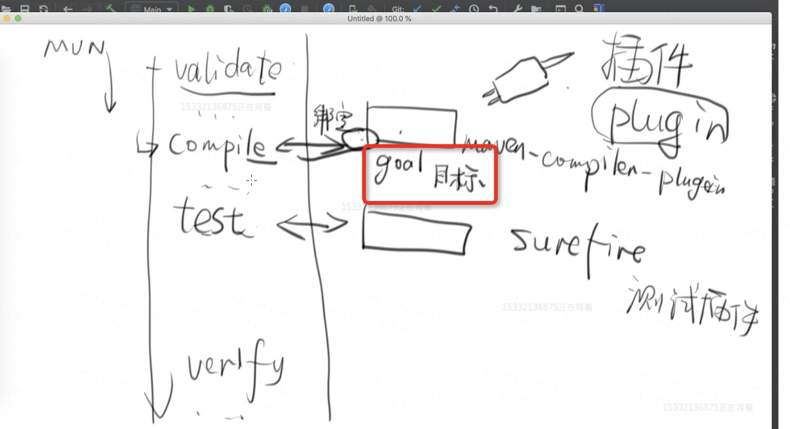


> 此时再来看这个 pom.xml里的 plugins

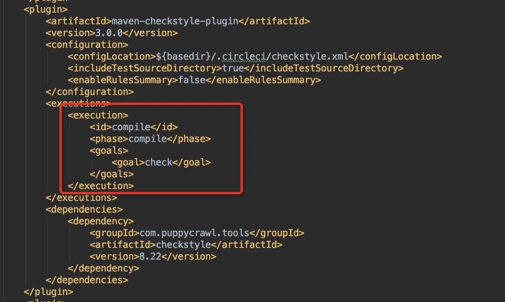

意思就是绑定到 compile 阶段

> 问题1：一个阶段绑定了多个 goal 谁会先执行呢？

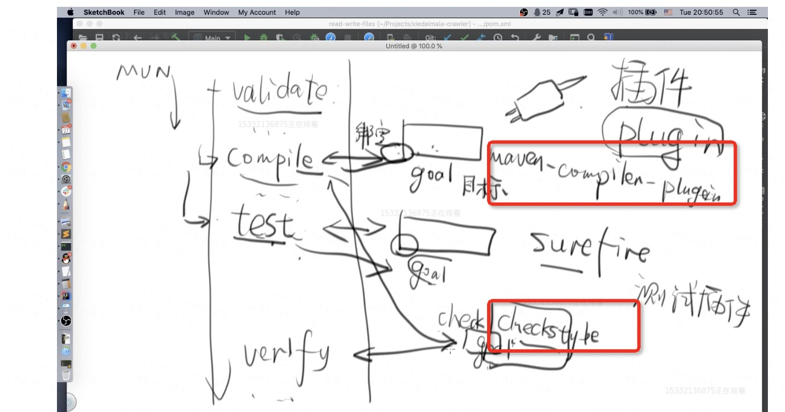

- maven-compiler 绑定了 compile 
- check-style 也绑定了在 compile
- 答案非常简单： 谁先声明的谁先执行

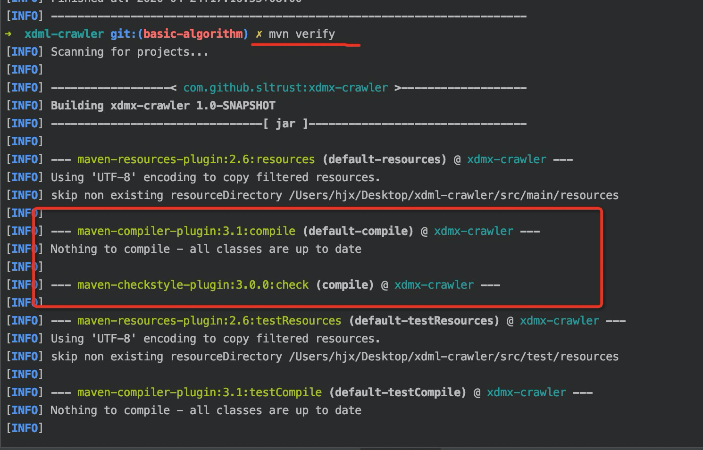

> 问题2 `check-style`插件能绑定在两个阶段吗？

- 可以，只要你不觉得自己蛋疼

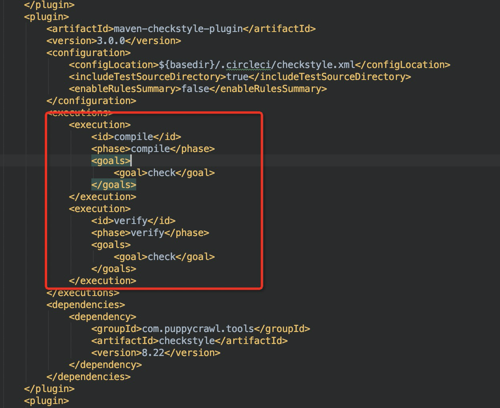
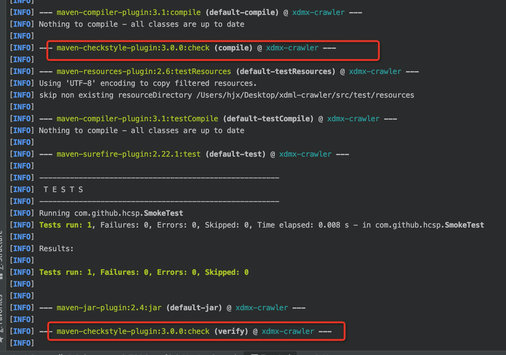

这样的意义在于：**你可能会有在不同阶段传递不同的参数**


