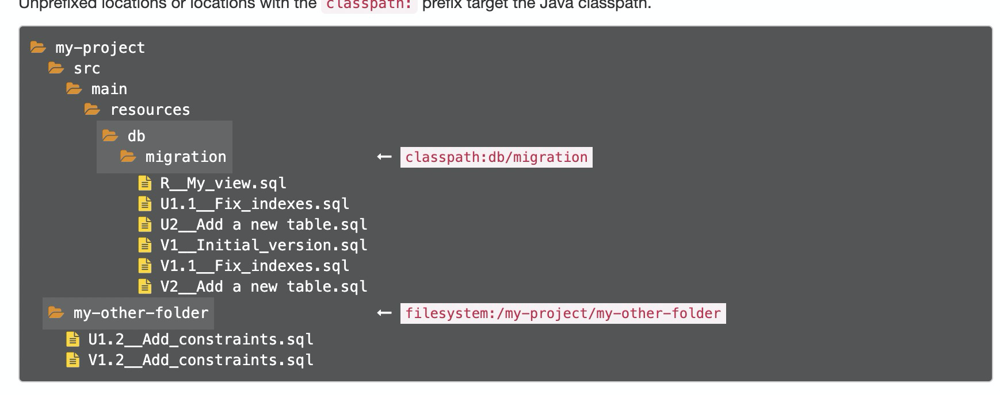

> 我们每次都要手动创建数据库

- 很麻烦，容易错
- 还要手动录入一条数据

## 如何自动化数据库？

- google 自动化数据库新建工具 maven
    - 看到很多人说 flyway
- https://flywaydb.org/
- 找到 maven依赖

```
<plugin>
    <groupId>org.flywaydb</groupId>
    <artifactId>flyway-maven-plugin</artifactId>
    <version>5.2.4</version>
    <configuration>
        <url>jdbc:h2:file:/Users/hjx/Desktop/xdml-crawler/news</url>
        <user>root</user>
        <password>root</password>
    </configuration>
    <dependencies>
        <dependency>
            <groupId>com.h2database</groupId>
            <artifactId>h2</artifactId>
            <version>1.4.199</version>
        </dependency>
    </dependencies>
</plugin>
```

- 按照 flyway 文档- migrations章节
    - https://flywaydb.org/documentation/migrations
    - 在 `src/main/resources/`新建 `db/migration/V1__Initial_version.sql`
        - 注意是双下划线
        - V后的数字代表版本



- 然后`mvn flyway:migrate`