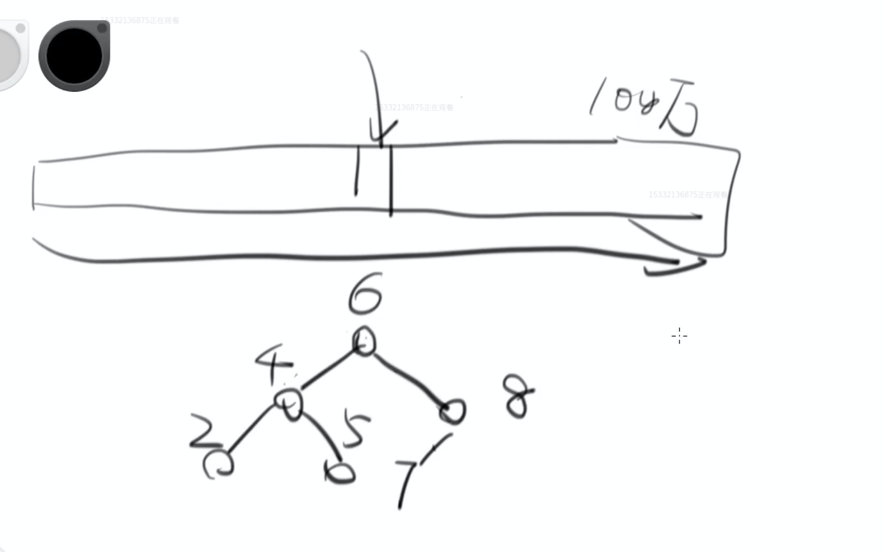
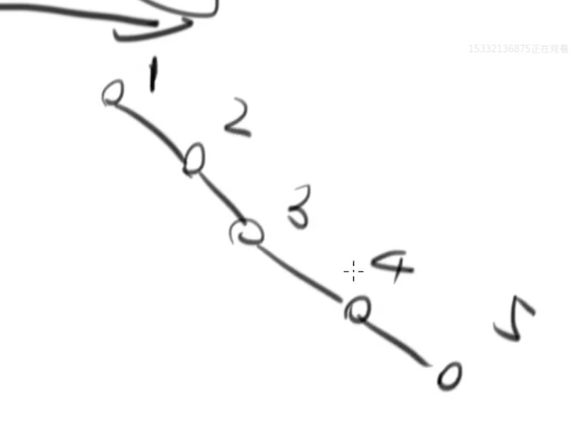
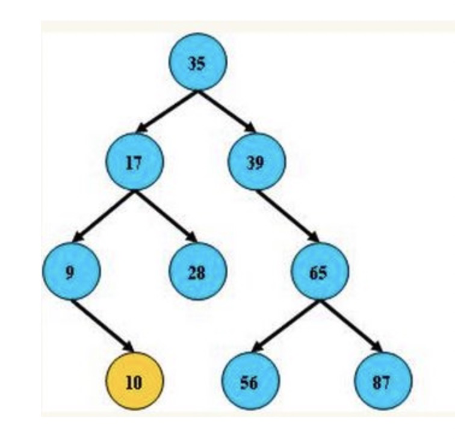
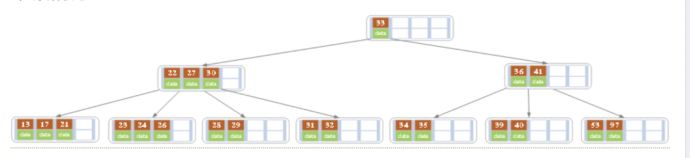

### java世界里的时间

- java8以后请使用`Instant` ,而不是 date
- 老程序可能是date 新程序推荐 Instant

### MyBatis 约定

> created_at 查不出来？

- 数据库约定是 不区分大小写
- 而Java对象里则是 createdAt

此时你要加配置 `mapUnderscoreToCamelCase` 开启驼峰映射

**注意 settings 必须放在其他东西之前**

```
<configuration>
    <settings>
        <setting name="mapUnderscoreToCamelCase" value="true"/>
    </settings>
    <environments default="development">
       ...
    </environments>
    <mappers>
        ...
    </mappers>
</configuration>
```

### 数据库索引

> 假设你有100万条数据你怎么查？



- 最慢的方式：从头到尾这样线性的找。这是不能容忍的
- 好一点的方式：于是有了平衡二叉树
    - 左孩子节点始终小于右孩子节点，这样每次就能排查一半的元素。使查找效率大大提高，但是这样有个缺点

> 平衡二叉树的缺点

一旦变成这样的不平衡的二叉树。它的查询效率和你挨个找没有任何区别了



因此在数据库引擎里出现这样一个结构 **B+树**

### B树

- [维基](https://zh.wikipedia.org/zh-hans/B%E6%A0%91)
- [知乎：平衡二叉树、B树、B+树、B*树](https://zhuanlan.zhihu.com/p/27700617)

二叉树



B树




1. 相比二叉树它是一个多叉树，每个节点包含多个记录
    - 这样的结果就是它树的**高度非常低**
        - 带来的好处是：对于磁盘IO有利。意味着你查找数据只需要几次就能找到。
2. 第二个好处这些节点都包含范围。因此你要是进行范围查找它可以迅速找到头节点、尾节点。
    - 另外磁盘的读取有一个**预读取过程**
        - 上古时代的 机械硬盘通过磁盘旋转来读取数据的方式。他在读取数据的时候顺便把离得近的数据读到缓存中。因此把相邻的记录放在一起的数据结构非常有优势

### B+树

B+树是B树的一个升级版，相对于B树来说B+树更充分的利用了节点的空间，让查询速度更加稳定，其速度完全接近于二分法查找。为什么说B+树查找的效率要比B树更高、更稳定；我们先看看两者的区别

**它请继续看这篇文章**

- [知乎：平衡二叉树、B树、B+树、B*树](https://zhuanlan.zhihu.com/p/27700617)


