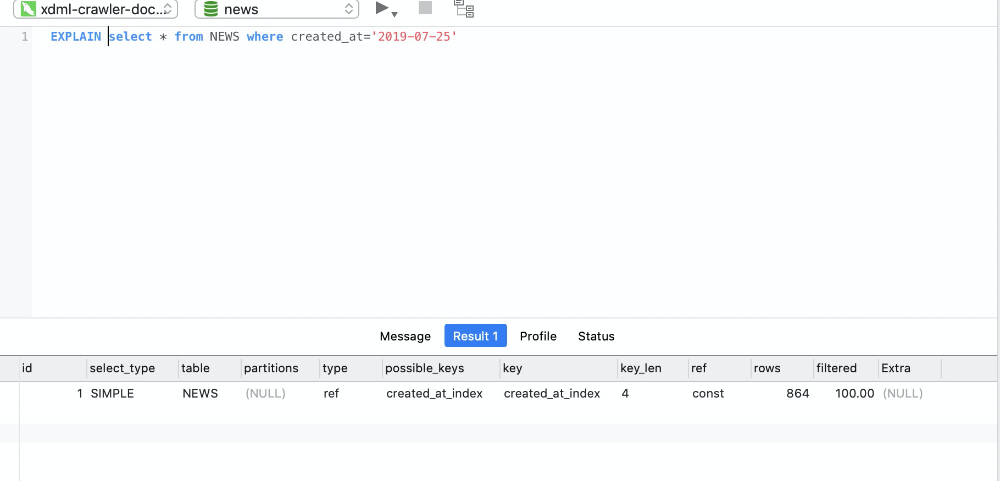

**请先看前面一节，在看这个**

## 索引

假设我们有一张表

```
create table NEWS (
    id bigint primary key auto_increment,
    name varchar(200),
    time timestamp default now()
)
```

在数据之外，mysql会维护一个**B+树**,它是以id 为主索引

- 如果你根据Id查找的话，它可以快速的找到这个数据

> 假设此时我们给另一个列 name 添加索引

- mysql就会维护一个新的B+树 name索引
- 其中每一个记录都指向主索引 也就是id


这样每当你根据name查找就会 首先执行name索引，找到id之后回去找主 索引拿到真正的数据。因为真正的数据可能非常长。

### 联合索引

**假设我们有 a,b,c,d 四个字段**

> 你可以单独分别给他们建立索引

- 此时 `where a =xxx` 的时候会很快
- 而当你 `where a = xxx and b = xxx`的时候 会被优化为先去找a再去找b

- 此时你可以建立一个 **联合索引**

> 所谓的联合索引就是：

```
假设你 a,b,c,d 四个字段
你可以分别建立 a,b,c,d 单个索引

你还可以建立联合索引
(a,b) =>
        a 
        (a,b)

同理
(a,b,c) =>
        a
        a,b
        a,b,c
```

这个原则叫做 **最左前缀匹配**

> #### 案例

- 假设你有a,b,c,d四个字段
- 你建立了(a,b,c,d) 联合索引
    - 等价于你有如下索引
        ```
        1 a
        2 a,b
        3 a,b,c
        4 a,b,c,d
        ```

有什么用呢？假设语句是这样

```
select * from xx where 
    a = 1 and b=2 
    and c > 3 and d =4
# 其中 c > 3 是范围查找 索引用处就不大了
sql优化器 每当看到范围索引就会 到此为止，把前面的东西试图使用联合索引的方式

此时 后面的 d = 4 是用不了索引的

为什么？
很容易理解 
a = 1 and b =2 and d = 4 and c > 3
此时你需要的是 (a,b,d) 联合索引
但是很不幸我们建立的是 (a,b,c,d) 的索引

那么怎么办呢？
这个过程就是 索引优化的过程！！！
因此 你可以建立 (a,b,d)索引来达到 效率的提升
```


### 一个mysql的坑

- 计算机时间纪元的开始是 1970年1月1日
- 因此在 mysql中，小于 1970这个数值的时间 不能用 timestamp 存储的


### 100万条数据索引优化

- 参考这个表自行创建100万条数据

```
create table NEWS (
    id bigint primary key auto_increment,
    title text,
    content text,
    url varchar(1000),
    created_at timestamp default now(),
    modified_at timestamp default now()
)DEFAULT CHARSET=utf8mb4;
```

- 索引对范围查找的性能提升是很低的，所以我们把数据修改下
    - 去掉它的时分秒

```
update NEWS set created_at = date(created_at),modified_at = date(modified_at);
```

> 改完数据之后 把 creatd_at，modified_at为例

```
select * from NEWS where created_at='2019-07-25'
```


如图竟然花了 21秒

> 建立索引

```
# 创建索引
CREATE INDEX created_at_index
    ON NEWS (created_at)

# 查看索引
show index FROM NEWS;
```


- 通过索引可以给我们带来巨大的性能提升

### 如何分析性能，优化索引呢

- explain 告诉你条sql如何被执行
    - 它是非常重要的，当我们要做优化的时候。为我们提供非常多的信息。

```
explain select * from NEWS where created_at='2019-07-25'
```



- [MySQL 索引优化全攻略](https://www.runoob.com/w3cnote/mysql-index.html)

### 创建 created_at 和 modified_at 的联合索引

```
# 创建索引
CREATE INDEX created_at_modified_at_index
    ON NEWS (created_at,modified_at)

# 查看索引
show index FROM NEWS;
```

> 假设这样查询

```
# 联合索引 (created_at,modified_at)

# 只会匹配 created_at
select * from NEWS where 
created_at='2019-07-25' and modified_at<'2019-10-25'


# 如果这样，你会发现速度明显下降。因为没有modified_at的索引
select * from NEWS where 
created_at>'2019-07-25' and modified_at='2019-07-25'
```


**结论：索引不是越多越好，而是越符合你的实际业务情况越好**

- 根据你的业务创建你的索引
- 因为索引是要占用空间的
