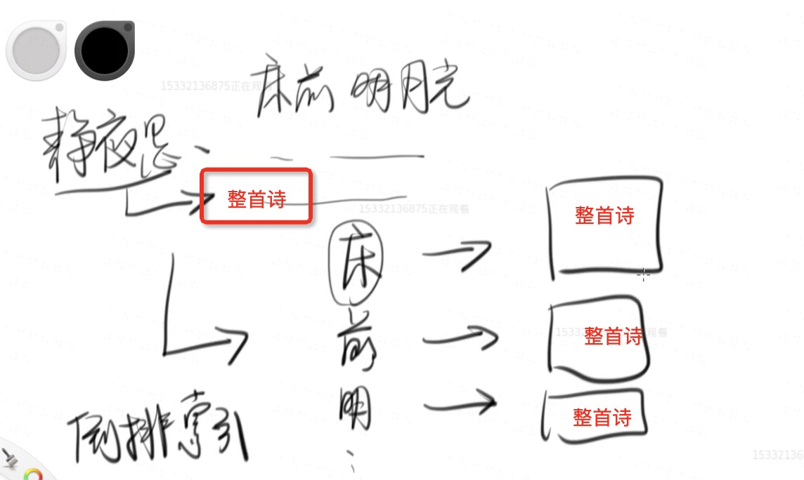
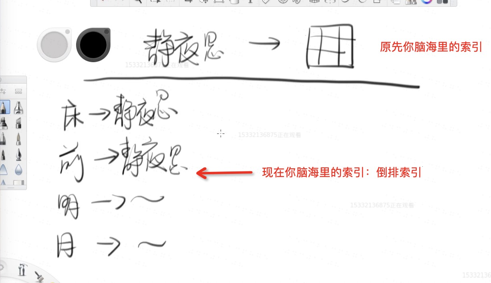
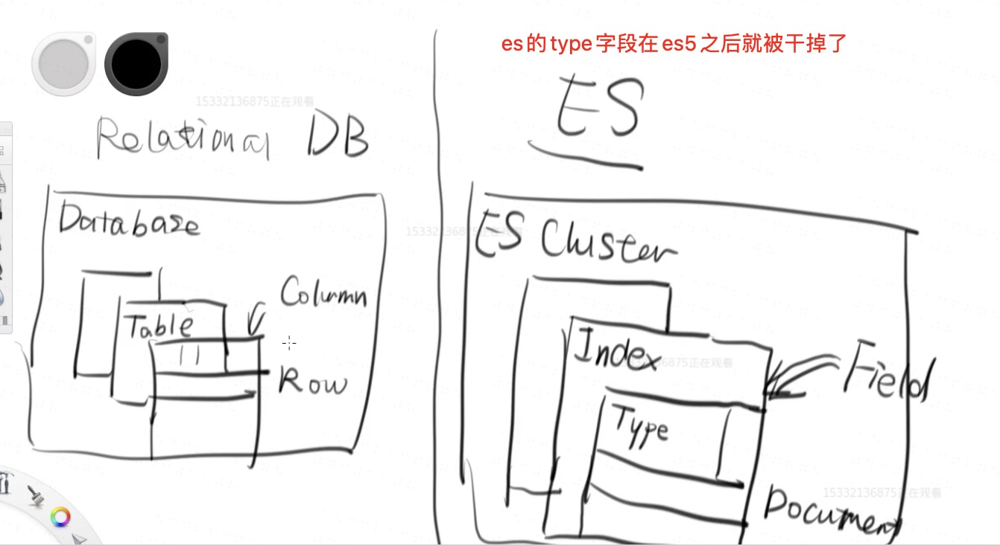

> mysql 模糊查询

```
select * from NEWS where content like "%123%";

100万的数据 mysql它会慢的让人难以忍受
```

- mysql的长处在于非文本的数据的索引
- 而如果是检索文本里的一个字符串 它就会显得力不从心

## ES索引及原理

### 倒排索引

- 为什么传统数据库 id 查询很快，因为默认 id索引会创建一个 B+树

> 但是对于文本来说： B树这种数据结构就会显得力不从心了

- 因为它不是一个 id=? 的匹配，而是 contain 操作

#### 中国诗词大会场景

> 主持人给你一个“月” 字，你们把所有包含“月”字的诗词背出来

- 这个过程你会非常痛苦～
    - 我们都背过“李白的静夜思” 床前明月光。。。。
    - 为什么 让你背 静夜思 能立刻背出来
        - 因为你脑海里存储着一个 从 “静夜思” =》 静夜思全部诗词的 的索引
    - 但是如果让你把 所有带 “月” 字的诗词找出来的时候
        - 你没有办法，只能把脑海里所有带 “月”的过一遍，如果包含月 捞出来，这个时候效率非常低

于是你像这样构建一种映射关系

- 床 -> 整首诗
- 前 -> 整首诗
- 明 -> 整首诗
- 月 -> 整首诗
- 光 -> 整首诗



但是 每次一个字就映射“整首诗” 占用空间太大了

于是演变成 把每个"字" 映射到 “静夜思”

- 床 -> 静夜思
- 前 -> 静夜思
- 明 -> 静夜思
- 月 -> 静夜思
- 光 -> 静夜思



这样把你脑海里所有的诗都这样存一个 “每个字”到“诗词名” 的索引——倒排索引

下次你去参加诗词大会，就可以迅速把 带“月”字的歌词背一遍

**这就是 Elasticsearch的索引原理**


### ES实战

> 安装es

- 依然推荐 docker方式

```
google docker elasticsearch
得到 https://hub.docker.com/_/elasticsearch

docker run -d --name elasticsearch -p 9200:9200 -p 9300:9300 -e "discovery.type=single-node" elasticsearch:tag

# 我们使用 7.4版本，同时选一个目录持久化数据

mkdir esdata

docker run -d -v `pwd`/esdata:/usr/share/elasticsearch/data --name elasticsearch -p 9200:9200 -p 9300:9300 -e "discovery.type=single-node" elasticsearch:7.4.0

运行成功后你就可以访问 验证一下是否启动成功 
http://localhost:9200/
```

- `http://localhost:9200/_count?pretty` 查看数据数量
- `http://localhost:9200/_search` 搜索



> ES基本概念

- 可以参考这个 [ES基本概念总结](https://github.com/slTrust/node_lesson/tree/master/017%E5%AE%9E%E6%97%B6%E5%88%86%E5%B8%83%E5%BC%8F%E6%90%9C%E7%B4%A2%E5%92%8C%E5%88%86%E6%9E%90%E5%BC%95%E6%93%8EElasticsearch)


#### ES数据的生成器

- 引入es依赖

```
<dependency>
    <groupId>org.elasticsearch.client</groupId>
    <artifactId>elasticsearch-rest-high-level-client</artifactId>
    <version>7.4.0</version>
</dependency>
```

可以看我的代码

```
public class ElasticsearchDataGenerator {
    public static void main(String[] args) throws IOException {
        SqlSessionFactory sqlSessionFactory;
        try {
            String resource = "db/mybatis/config.xml";
            InputStream inputStream = Resources.getResourceAsStream(resource);
            sqlSessionFactory = new SqlSessionFactoryBuilder().build(inputStream);
        } catch (IOException e) {
            throw new RuntimeException(e);
        }

        List<News> newsFromMySQL = getNewsFromMySQL(sqlSessionFactory);

        for (int i = 0; i < 10; i++) {
            new Thread(() -> writeSingleThread(newsFromMySQL)).start();
        }
    }

    private static void writeSingleThread(List<News> newsFromMySQL) {
        try (RestHighLevelClient client = new RestHighLevelClient(RestClient.builder(new HttpHost("localhost", 9200, "http")))) {
            // 单线程写入2000*1000 = 200_0000数据
            for (int i = 0; i < 4000; i++) {
                BulkRequest bulkRequest = new BulkRequest();
                for (News news : newsFromMySQL) {
                    IndexRequest request = new IndexRequest("news");

                    Map<String, Object> data = new HashMap<>();

                    data.put("content", news.getContent().length() > 10 ? news.getContent().substring(0, 10) : news.getContent());
                    data.put("url", news.getUrl());
                    data.put("title", news.getTitle());
                    data.put("createdAt", news.getCreatedAt());
                    data.put("modifiedAt", news.getModifiedAt());

                    request.source(data, XContentType.JSON);

                    bulkRequest.add(request);
                }

                BulkResponse bulkResponse = client.bulk(bulkRequest, RequestOptions.DEFAULT);

                System.out.println("Current thread: " + Thread.currentThread().getName() + " finishes " + i + ": " + bulkResponse.status().getStatus());
            }
        } catch (IOException e) {
            throw new RuntimeException(e);
        }
    }

    private static List<News> getNewsFromMySQL(SqlSessionFactory sqlSessionFactory) {
        try (SqlSession session = sqlSessionFactory.openSession()) {
            return session.selectList("com.github.hcsp.MockMapper.selectNews");
        }
    }
}
```

#### ES查询

```
public class ElasticsearchEngine {
    public static void main(String[] args) throws IOException {
        while (true) {
            System.out.println("Please input a search keyword:");

            BufferedReader reader = new BufferedReader(new InputStreamReader(System.in));

            String keyword = reader.readLine();

            search(keyword);
        }
    }

    private static void search(String keyword) throws IOException {
        try (RestHighLevelClient client = new RestHighLevelClient(RestClient.builder(new HttpHost("localhost", 9200, "http")))) {
            SearchRequest request = new SearchRequest("news");
            request.source(new SearchSourceBuilder().query(new MultiMatchQueryBuilder(keyword, "title", "content")));

            SearchResponse result = client.search(request, RequestOptions.DEFAULT);

            result.getHits().forEach(hit -> System.out.println(hit.getSourceAsString()));
        }
    }
}
```

### 如果你想深入理解ES

推荐一本书 **Elasticsearch权威指南**


    


